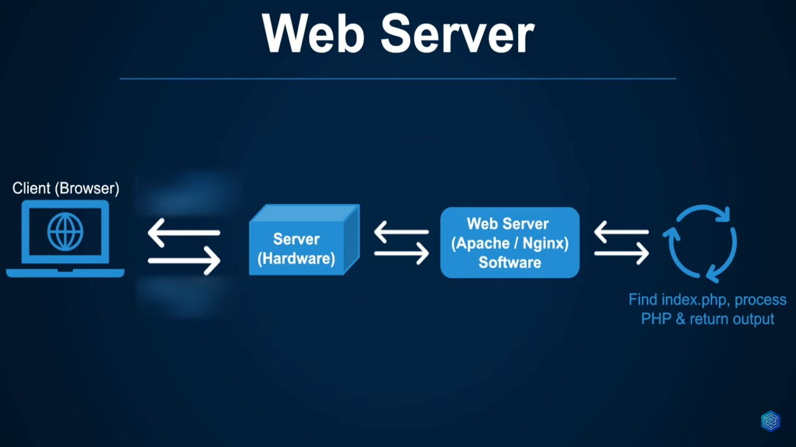

# Installtion & Web Servers

Before we can write any PHP we need to have the local devleopment environment setup for it.

Whe talking about a web server you could rever to:

- hardware
  - web server on the hardware is just computer that stores the web server software source code and some other stuff.
- software
- hardware & software

A web server can process incoming request using different protocols typically **HTTP** protocol which is the protocol used by the browser to view the web pages, a web server can host either a single or multiple websites on the same server using the same resource this is done by something called virtual hosts where the single web server is able to allocate and share resource across multiple websites.

**_Simple diagram how the client and server communicate:_**

## Most commont web servers

They both have their pros and cons:

- **APACHE**
- **NGINX**

## Ways to install PHP in OS?

- **PHP** installed in OS.
  - manual installation
  - manual **DB** installation
  - manual configuration
- **XAMPP** / **MAMP** / **WAMP**
  - all in one solution
  - contains web server
  - contains database
  - preconfigured
- **Virtual Machine** / **Docker**
  - better alternative (covered in separate video)

## XAMPP drawback

- No multiple **PHP** versions
- No multiple **MySQL** versions
- Not for production (due to it security)
- Difficult to maintain multiple projects
- Works on machine (but not in server)
